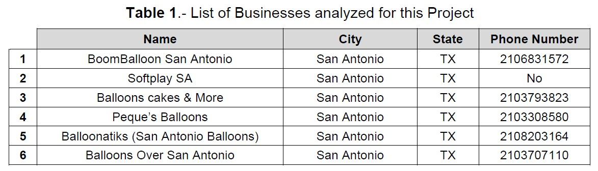
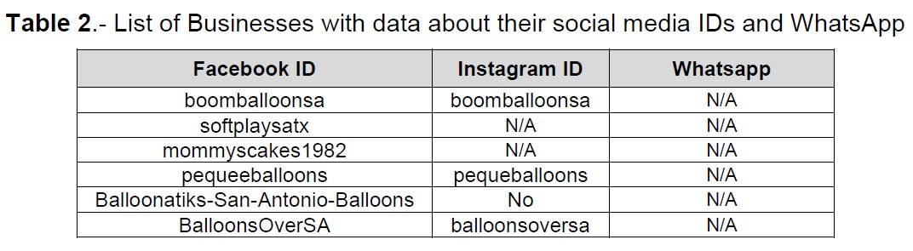
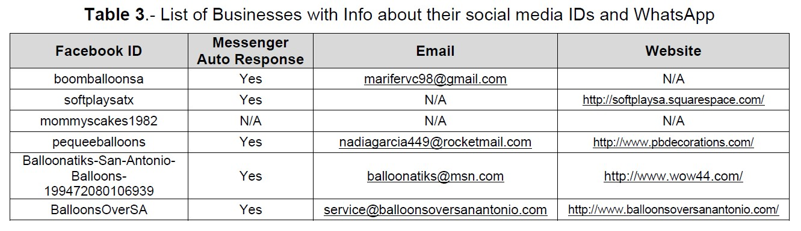
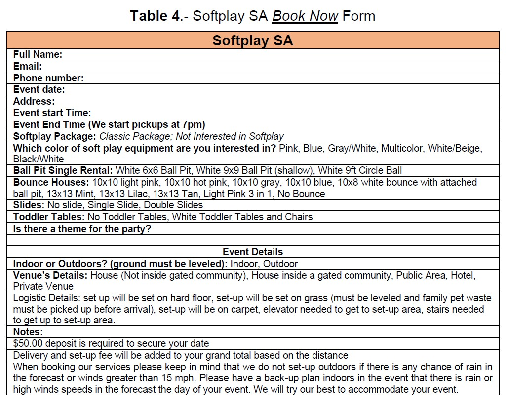
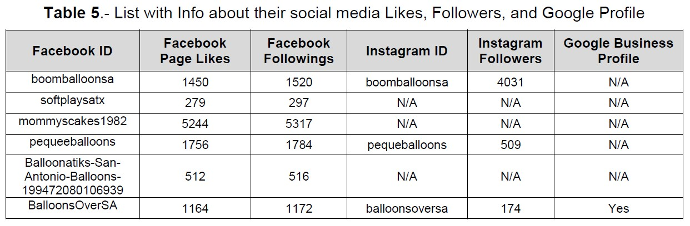
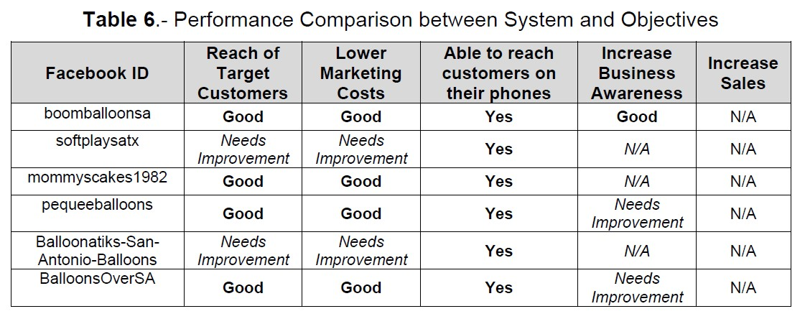
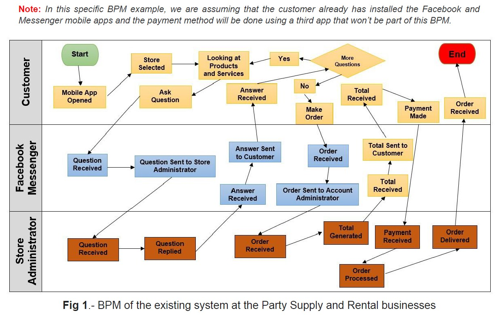
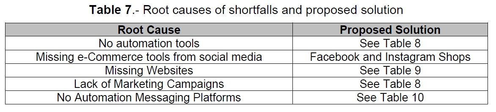

# Enterprise-Systems-Design-Project

The project will focus on analyzing the current system used by the stores to sell and manage their orders. The project will recommend new system design improvements that will help the businesses take advantage of the forecasted compound annual growth rate in the upcoming years.

# Introduction Summary

The Global Party Supply Rental Market is expected to have a compound annual growth rate (CAGR) of 7.18% between 2021 and 2027. The growth will allow the market to reach a total of USD 29.13 billion in 2027. The COVID-19 pandemic disrupted the global market and caused consumer purchasing behaviors (Party, 2022). The COVID-19 pandemic accelerated the transition to the e-Commerce economy. The e-Commerce and digital trade share of total retail sales growth in the United States from 11.8 to 16.1 percent during the first half of 2020 (Covid, 2021). This study aims to identify current Enterprise Systems platforms used by Party Supply and Rental Shop businesses around the San Antonio area.

The project will focus on analyzing the current system used by the stores to sell and manage their orders. The project will recommend new system design improvements that will help the businesses take advantage of the forecasted compound annual growth rate in the upcoming years. The objectives of the new system are the following:

• Provide expedited customer support

• Trigger real-time notifications of new orders and payments received

• Integrate the system into Digital Ads campaigns

• Able to handle customer growth

• Able to use bots

• Capable to perform data analytics

# Part 1: Analysis of the Existing System

# Enterprise Analysis

The analysis was based on a total of six different businesses in the Party Supply and Rental shop business segment. All businesses are based out in San Antonio, TX. The business’s focus is the specialized tailor-made balloons and party supply rental for birthdays, weddings, company parties, BBQ parties, and special occasions events. A list of the businesses analyzed for this project is presented in Table 1 which includes the businesses’ names, as shown on Facebook, City, State, and Phone numbers.

The businesses look to become the best choice in the Party Supply and Rental shop business segment for the individual customer and corporate clients in the San Antonio city area. The six businesses base their business strategy on maintaining Facebook, Instagram, and business websites as the main online channels to commercialize their products.

This study will assume that Facebook page objectives are the same as the ones that the businesses are trying to accomplish as Facebook is the only platform on which all the businesses in this study are active. Business objectives are not available to consult
as five out of six businesses do not have a physical location listed on their Facebook page.

Table 2 shows the list of businesses with their corresponding Facebook and Instagram IDs. None of the businesses has a direct link or linked its Facebook messenger to WhatsApp.

Facebook pages aim to reach some of the 2.7 billion monthly active users on Facebook. Facebook Business pages are an easier way for small and medium businesses to reach clients in a cost-effective way (Nussey, 2022). A list of the Facebook Business Pages objectives is presented below:

• Reach target customers

• Lower marketing costs

• Able to reach customers on their phones

• Increase Business Awareness

• Increase Sales of products or services

The main reason behind this project is to prepare the Party Supply and Rental shop businesses from San Antonio, TX to capitalize on the forecasted compound annual growth rate (CAGR) of 7.18% between 2021 and 2027 and to take advantage of the e-Commerce and digital trade increase in the United States from 11.8 to 16.1 percent during the first half of 2020 (Covid, 2021).

The current system used by all the businesses has constraints that limit their opportunity to develop and grow organically. The system is not able to capitalize on the benefits that Facebook Business Pages offer to build loyal customers and create product recognition from past clients. The system highly depends on human intervention to answer chats even though five out of the six businesses have activated the messenger auto-response fixture as seen in Table 3 below.

The system does not provide customers with an estimated price on services and products available for sale or rental. The way that the system handles customer requests for pricing takes a long time and might cause a bottleneck during peak days’ requests.

An ideal system will provide clients with a Chatbot Platform that will deliver automatic responses and will be able to filter clients depending on their type of request. The same management chat system should be able to perform data analytics on data collected during chat sessions to increase ROI on targeted marketing campaigns.

# Existing System Architecture

All the systems used by the six businesses are mainly based on the Facebook platform. Pequeballoons, boomballoonsa, and balloonsoversa have active Instagram accounts. Softplaysatx, pequeeballoons, Balloonatiks, and BalloonsOverSA have websites promoted on their Facebook accounts. All of them are online and working with except for the pequeeballoons one. The SoftplaySA website is the most advanced one and uses the Squarespace eCommerce platform to host, support and layout the website. The website does a good job showing price information of the products and services that the business provides. The most important page of the website is the Book Form. The Book Form is designed to gather all information needed to accommodate, book, and set up rental equipment provided by SoftplaySA.

Businesses with Instagram and Facebook accounts use both platforms to showcase their previous work and to display contact information like website, phone number, and email. The current system for all the businesses meets the business expectations to some extent but customer experience is poor as some improvements are needed to facilitate sales, customer satisfaction, data analytics, and customer communication.

# Existing System Performance Assessment

An analysis of the system’s current performance was done using the total number of Likes and Followers on each of the Facebook and Instagram profiles for each of the businesses. The mommyscakes1982 Facebook ID had the largest amount of Likes and Followings from all the profiles. The boomballoonsa Instagram profile had the highest number of Instagram followers with a total of 4031. The BalloonsOverSA was the only business with a Google Business Profile and a physical address available. The remaining data can be seen in Table 5 below.

Table 5 was used to perform a performance comparison between the actual system for each business and the stores’ objectives. The “reach of target customers’ objective” and “Lower Marketing Costs” were evaluated with the average number of the total Facebook likes and followers.

The Facebook pages with less than 1000 Likes showed a “Needs Improvement” and the ones above 1000 showed a value of “Good”. The “Increase Business Awareness” objective was evaluated with the total number of Instagram followers. The Instagram profiles with less than 1000 were assigned “Needs Improvement”. The businesses with no active Instagram profile were assigned “N/A”. The boomballoonSA business has a total of 4031 followers so its qualification was “Good”. The “Increase Sales” objective was not possible to quantify its performance as no sales data was available.

A summary of the performance comparison for each objective is presented in Table 6.

The system being used by the stores analyzed in this project lacks consistency among them. Some of the business objectives need improvement and others could not be evaluated at all. Some of the root causes of the shortfalls with the system are the following: the system is 100% operated by humans with little interaction from automation tools, missing e-Commerce tools from social media, missing websites, lack of marketing campaigns, and no use of automation messaging platforms.

The new system will focus on solving the root causes responsible for the shortfalls and will emphasize the use of Artificial Intelligence, Data Analytics, and Machine Learning to facilitate the daily tasks of employers to manage the stores and close the performance gaps shown in Table 6.

# Data Analysis

The current system has access to user data on the Facebook page. The platform allows to visualize mostly descriptive data from customer liking or visiting the page over a period. The data visualization is available for the page administrator to access on the Administrator Menu. Predictive and Prescriptive Analytics is not being used currently.

# BPM of existing processes

Create a business process model depicting the existing process of a person ordering decorations and party equipment for a birthday from the Party Supply and Rental shop via the Facebook Page from a smartphone.

# Part 2: Proposed System Design

# Benchmarking

The proposed New System Design looks to solve the root causes responsible for the shortfalls with the old system. Table 7 provides a summary of the Root Causes and a Proposed Solution, Tool, or Software for each of the causes.

Social Media is a real ally when trying to start promoting your medium or small businesses. Social Media is free and can provide a lot of exposure for your products and services. At the same time, social media can demand a lot of time from your daily routine and take time from your creative process. Automation tools are the best way to help you manage your social media profiles to increase efficiency, improve your return on investment (ROI), and get better customer satisfaction from your clients (Connell, 2022).

Automation tools are available to some extent within the Facebook and Instagram Platforms. Meta has focused on adding new features to help entrepreneurs develop their businesses. The Meta Business Suite is the answer from Meta to help businesses to manage their social media business activity from one place. The Meta Business Suite is a free tool that helps businesses to manage their Facebook, Instagram, and Messenger activity from one tool (Meta, 2022).

# Determination of Solution Approaches and Requirement Analysis

The growth of the Digital Market and Social Media economies have facilitated the creation of social media automation tools. These tools can be used if the Meta Business Suite solution does not meet the requirements of your company or business. Table 8 provides a list of thirteen social media automation tools available on the market to help you manage your social media profiles.

